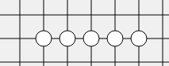
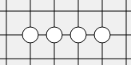
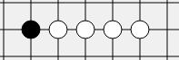
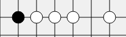
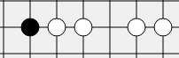
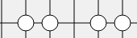
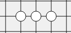
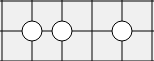
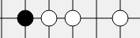
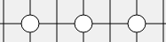

# qt-gobang

基于α-β剪枝的五子棋AI


人工智能基础的课程作业。

参考了https://github.com/livingsu/Gobang-ai
思路大体相同、代码部分进行了重写。界面基本一样。只实现了α-β剪枝的方法。下面会对评价函数和α-β剪枝部分做详细介绍。

### 评价函数的设计实现

α-β剪枝算法的搜索过程可以说是深度优先策略的极小极大过程，它的优点就是可以通过剪枝来减小状态空间节点的生成和搜素，从而可以达到更大的搜索深度。它需要先应用评估函数计算出叶节点的估值，从而估算叶节点祖先的估值范围，实现剪枝。

#### 两种评估函数的选择

查阅网络中各种资料，五子棋的评估函数可以分为两类。

第一类函数针对下一步可以走的空位进行评分。一般认为如果某一个空位可以与周围的棋子形成更好的棋形，则这个位置的评分越高。下一步就应该走这个位置。

第二类函数针对当前的局面进行打分。即不论最近走的是哪一个位置，评估函数只根据这一步落子之后形成的局面进行打分。

由于要使用α-β剪枝算法，必须采用第二类的评价函数。因为在极小极大过程中，每一个搜索的节点都对应一种棋局的状态，也就是当前的局面。只有通过对应整个状态进行打分，才能使得极小极大过程进行。对于某一个位置打分，而将其用作整个状态的分数，并在极小极大过程中作为父节点的分数，这是不对的。

#### 五子棋的基本棋形

对于整个局面的打分，需要依赖于五子棋当中的一些基本的棋形。下面就一一介绍这些棋形。

1. 连5



2. 活4



3. 冲4

 



只要是仅一端有不同颜色的棋，并且在一条线上再落一子可以成连5的棋都是冲4。或者不是活4，但是再落一子可以成连5的棋也是冲4。

4. 活3



只要再落一子可以成活4的棋形均为活3。

5. 眠3



再落一子可以成冲4的棋均为眠3。

6. 活2

类似，再落一子可以成活3的棋形均为活2。

7. 眠2

类似，再落一子可以成眠3的棋形均为眠2。

8. 活1

最常见的所谓“单独一个子”。再落一子可形成活2。

#### 各棋形的权重设计

为了给局面打分，在整个局面中搜索可能出现的上述棋形。不同的棋形出现时，给整个局面加上不同的分数。假设我们现在是白棋，那么白棋的上述棋形会加分，而黑棋的上述棋形会减分。设计棋形分值表如下：

| 棋形  | 分值    | 棋形  | 分值      |
| ----- | ------- | ----- | --------- |
| 白连5 | 5000000 | 黑连5 | -10000000 |
| 白活4 | 50000   | 黑活4 | -100000   |
| 白冲4 | 400     | 黑冲4 | -100000   |
| 白活3 | 400     | 黑活3 | -8000     |
| 白眠3 | 20      | 黑眠3 | -50       |
| 白活2 | 20      | 黑活2 | -50       |
| 白眠2 | 1       | 黑眠2 | -3        |
| 白活1 | 1       | 黑活1 | -3        |

#### 棋形匹配

现在，各种棋形相应的评分有了，需要实现对于整个局面的打分，则需要实现对于整个局面中，各棋形的匹配。

为了简便且不重复匹配，设计匹配方式如下：

用六元组表示各种棋形。每一位有4种状态，空格、越界、己方棋子，对方棋子。假设我们现在是白棋。对每个状态进行编码，空格-0、越界-3，黑棋-1、白棋-2。那么就可以设计一个六维数组表示六元组，并用六维数组的初始化存储棋形编码和相应评分。

为了简便且不重复，规定六元组第0位不能是己方棋子，第1位必须是己方棋子。部分代码如下：

```c++
	//0空,1黑子,2白子,3边界
    //第0位非己方棋子，第1位己方棋子
    //白连5
    tuple6[0][2][2][2][2][2] = R_WIN;
    tuple6[1][2][2][2][2][2] = R_WIN;
    tuple6[3][2][2][2][2][2] = R_WIN;
    //白活4
    tuple6[0][2][2][2][2][0] = R_FLEX4;
    //白冲4
    tuple6[1][2][2][2][2][0] = R_BLOCK4;
    tuple6[3][2][2][2][2][0] = R_BLOCK4;
    tuple6[0][2][2][2][2][1] = R_BLOCK4;
    tuple6[0][2][2][2][2][3] = R_BLOCK4;
    for(int i=0;i<4;++i)
    {
        if(i==2) continue;
        tuple6[i][2][0][2][2][2] = R_BLOCK4;
        tuple6[i][2][2][0][2][2] = R_BLOCK4;
        tuple6[i][2][2][2][0][2] = R_BLOCK4;
    }
    //白活3
    tuple6[0][2][2][0][2][0] = R_FLEX3;
    tuple6[0][2][0][2][2][0] = R_FLEX3;
    for(int i=0;i<4;++i)
    {
        if(i==2) continue;
        tuple6[0][2][2][2][0][i] = R_FLEX3;
    }
    //白眠3
    for(int i=1;i<=3;++i)
    {
        if(i==2) continue;
        tuple6[i][2][2][2][0][0] = R_BLOCK3;
        tuple6[i][2][2][0][2][0] = R_BLOCK3;
        tuple6[i][2][0][2][2][0] = R_BLOCK3;
        tuple6[0][2][0][2][2][i] = R_BLOCK3;
        tuple6[0][2][2][0][2][i] = R_BLOCK3;
        tuple6[0][0][2][2][2][i] = R_BLOCK3; //特例
    }
    for(int i=0;i<4;++i)
    {
        if(i==2) continue;
        tuple6[i][2][2][0][0][2] = R_BLOCK3;
        tuple6[i][2][0][0][2][2] = R_BLOCK3;
        tuple6[i][2][0][2][0][2] = R_BLOCK3;
    }
    //白活2
    tuple6[0][2][0][0][2][0] = R_FLEX2;
    for(int i=0;i<4;++i)
    {
        if(i==2) continue;
        tuple6[0][2][0][2][0][i] = R_FLEX2;
    }
    for(int i=0;i<4;++i)
        for(int j=0;j<4;++j)
        {
            if(i==2||j==2) continue;
            tuple6[0][2][2][0][i][j] = R_FLEX2;
        }
    //白活1、眠2
    //白眠2
    tuple6[1][2][2][0][0][0] = R_BLOCK2;
    //白活1
    tuple6[0][2][0][0][0][0] = R_FLEX1;
    for(int i=0;i<4;++i)
    {
        if(i==2) continue;
        tuple6[i][0][2][0][0][0] = R_FLEX1;
        tuple6[i][0][0][2][0][0] = R_FLEX1;
        tuple6[i][0][0][0][2][0] = R_FLEX1;
        tuple6[i][0][0][0][0][2] = R_FLEX1;
    }
```

以上是白棋的六元组初始化代码示例。注意到其中有一组特例不满足关于第0位第1位的要求，不过这并不影响匹配的正确。

####   局势评分

在能够进行棋形匹配后，就可以给整个局面进行打分了。采用六元组进行棋盘扫描，在横向、竖向、左上向右下、右上向左下四个方向各扫描一次，将匹配到的棋形得分相加，得出整个局面的总得分。

以横向扫描为示例，给出代码如下：

```c++
EVA _AI::evaluate(int now_chessboard[15][15]){

    int board[17][17];   //增加了一圈边界的棋盘
    //3边界
    for(int i=0;i<17;++i)
        board[i][0] = board[0][i] = board[i][16] = board[16][i] = 3;

    for(int i=0;i<15;++i)
        for(int j=0;j<15;++j)
            board[i+1][j+1]=now_chessboard[i][j];

    EVA eval;
    eval.score = 0;  //记录当前局势得分

    bool win = 0, lose = 0; //记录是否对局结束

    //判断横向棋型
    for(int i=1;i<=15;++i)
        for(int j=0;j<=11;++j){
            int score = tuple6[board[i][j]][board[i][j+1]][board[i][j+2]][board[i][j+3]][board[i][j+4]][board[i][j+5]];
            eval.score += score;
            if(score == WIN) win = 1;
            if(score == R_WIN) lose = 1;
        }

    //判断竖向棋型
    ...

    //判断左上向右下棋型
    ...

    //判断右上向左下棋型
    ...
        
    if(win) eval.r = Win;
    else if(lose) eval.r = Lose;
    else eval.r = DRAW;

    return eval;
}
```

至此，评估函数的确定就完成了。

此外，可以注意到匹配过程中可能出现小部分棋形重复匹配，但由于设置棋形分值间隔较大，因此不影响正确性。

### α-β剪枝

在之前，已经实现了评估函数的计算。而α-β剪枝的算法思想，正是利用评估函数。它采用dfs的搜索策略，搜索到叶节点，并计算其评估函数的函数值，利用该估值来缩小该子节点的父节点的取值范围。一旦搜索到其他分支时，其估值超出了父节点的取值范围，则表示它一定不会被取用，从而剪枝。

在这里，由于五子棋棋盘呈15×15大小，如果我们每一层搜索都搜索所有的空节点，计算量很大。因此，采用以下方法：1. 仅搜索节点下一层中估值最大的10个状态。这样做的好处是缩小了状态空间，减小了计算量。并且一般来说，在距离其他棋子较远的许多空位置上落子后形成的局面显然不优，将状态空间缩小，就可以减少这一类不太有意义的搜索，而10个状态一般能够涵盖所有走法中较优的局面。2. 在深度优先搜索的每一层，优先搜索评分比较高的状态节点。这样做的好处是可能更快地得到较优的结果，从而剪枝剪去更多的状态。

#### 搜索节点的生成

在上文中，提到了搜索时采用的两种方法。因此，每一层的每一个节点仅生成10个子节点，它们搜索的顺序即DFS搜索的顺序。

选择10个节点的代码如下：

```c++
struct ePoint{
    QPoint p;
    int score;

    bool operator<(ePoint b) const
    {
        return score < b.score;
    }
};

POS _AI::chooseBest10(int board[15][15]){
    POS pos;

    int tboard[15][15];
    for(int i=0;i<15;++i)
        for(int j=0;j<15;++j)
        tboard[i][j] = board[i][j];

    std::priority_queue<ePoint> que;  //优先队列
    for(int i=0;i<15;++i)
        for(int j=0;j<15;++j)
        {
            if(tboard[i][j]!=0) continue;
            tboard[i][j] = 2; //0空,1黑子,2白子,3边界
            QPoint qp(i,j);
            ePoint ep;
            ep.p = qp;
            ep.score = evaluate(tboard).score;
            que.push(ep);
            tboard[i][j] = 0;
        }

    for(int i=0;i<10;++i)   //前10个分最高的局势
    {
        ePoint ep = que.top();
        que.pop();
        pos.pos[i] = ep.p;
        pos.score[i] = ep.score;
        qDebug()<< "坐标 " << ep.p.x() << " " << ep.p.x() << "   " << ep.score;
    }

    return pos;
}
```

经过以上的操作后，则可以根据某个状态生成10个较好的后继状态，此时需要落子的位置存储在上述代码中的结构体pos中。

#### α-β剪枝算法执行过程

```c++
int dfs(int board[15][15], int depth, int alpha, int beta);
```

该过程的思想已在上文中进行说明，下面对于代码的各部分进行拆解，逐段进行解释。

```c++
EVA eval = evaluate(board);

    //搜索到指定深度或者对局结束
    if(depth==DEPTH||eval.r!=DRAW){
        nodenum++;  //计数
        if(depth==DEPTH){
            POS pos = chooseBest10(board);
            qDebug()<< "到达DEPTH  " << pos.score[0];
            return pos.score[0];
        }
        else return eval.score;
    }
```

上述代码为搜索到叶节点之时的执行过程。由于设置DEPTH为偶数，则叶节点（如果没有分出胜负的话），一定处于MAX层。此时返回下一层的最大估值，即该叶节点提供的值。如果遇到了可以分出胜负的节点，则直接返回当前局面估值即可。

```c++
//搜索到MAX层
    else if(depth % 2 == 0){

        POS pos = chooseBest10(board);

        //搜索最好的前10个
        for(int i=0;i<10;++i){

            int tmpBoard[15][15];   //复制棋盘
            for(int k1=0;k1<15;++k1)
                for(int k2=0;k2<15;++k2)
                tmpBoard[k1][k2] = board[k1][k2];

            //0空,1黑子,2白子,3边界
            tmpBoard[pos.pos[i].x()][pos.pos[i].y()] = 2;
            int a = dfs(tmpBoard,depth+1,alpha,beta);
            if(a>alpha){
                alpha=a;
                if(depth==0){  //记录下一步要走的位置
                    nextPos.setX(pos.pos[i].x());
                    nextPos.setY(pos.pos[i].y());
                    qDebug() << "set下一步  " << "i " << i << "坐标  " << pos.pos[i].x() << " " << pos.pos[i].y();
                }
            }

            //剪枝
            if(beta<=alpha)
                break;
        }

        return alpha;
    }
```

上述为搜索到MAX层时的执行过程。取接下来的10个状态，按照当前局面优劣的先后排序进行递归搜索。回溯时则更新自身节点的α值。如果发现出现α值大于β值的情况，则下面的状态不可能实现，剪枝剪掉。

同时，在搜索到根节点时，要注意将最终估值最大的后继节点保存，即记录五子棋下一步要走的位置。

```c++
//搜索到MIN层
    else{

        int rBoard[15][15];   //复制棋盘并将颜色对调
        for(int k1=0;k1<15;++k1)
            for(int k2=0;k2<15;++k2){
                if(board[k1][k2]==1) rBoard[k1][k2] = 2;
                else if(board[k1][k2]==2) rBoard[k1][k2] = 1;
                else rBoard[k1][k2] = board[k1][k2];
            }

        POS pos = chooseBest10(rBoard);
        for(int i=0;i<10;++i){

            int tmpBoard[15][15];   //复制棋盘
            for(int k1=0;k1<15;++k1)
                for(int k2=0;k2<15;++k2)
                tmpBoard[k1][k2] = board[k1][k2];

            //0空,1黑子,2白子,3边界
            tmpBoard[pos.pos[i].x()][pos.pos[i].y()] = 1;
            int a = dfs(tmpBoard,depth+1,alpha,beta);
            if(a<beta){
                beta=a;
            }

            //剪枝
            if(beta<=alpha)
                break;

        }

        return beta;
    }
}
```

搜索到MIN层时，对方会选择对我们利益最小，即对他自己利益最大的。因此可暂时将黑白颜色对调，用相应函数找出对他利益较大的10个状态，再继续向下dfs递归搜索。在回溯时，更新β值，如果β值比α值小，说明我们不可能选取那种状态，因此剪掉。

以上，实现了α-β剪枝过程。由此可确定AI下一步五子棋落子的位置。

### 运行方式

界面使用了Qt框架，因此源代码需要在Qt环境中才能正常运行。

压缩包 五子棋.zip 为打包后的可执行程序，可以解压缩后点击gobang.exe直接运行。

